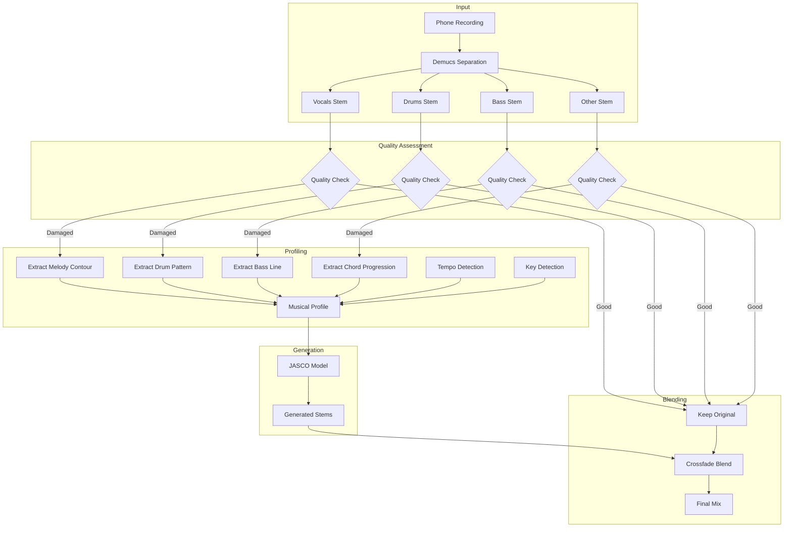

# JASCO Stem Regeneration Implementation Plan

## Overview

Add AI-powered stem regeneration to Resonate using JASCO (Joint Audio and Symbolic Conditioning) from AudioCraft. This enables reconstruction of heavily damaged or "cooked" stems (bass, drums) by extracting musical structure and regenerating plausible audio.

## Architecture



## Implementation Phases

### Phase A: Foundation - Stem Quality Detection

Create automatic detection of damaged stems based on artifact metrics.

**Files to create:**
- `audio_engine/profiling/__init__.py`
- `audio_engine/profiling/quality_detector.py`

**Quality Detection Criteria:**
- Clipping residual > 0.3 → Damaged
- Overall artifact score > 0.5 → Damaged
- SNR < 10 dB → Damaged
- Spectral holes detected → Damaged

### Phase B: Musical Profile Extraction

Extract musical structure from the original audio to condition JASCO.

**Files to create:**
- `audio_engine/profiling/chord_extractor.py` - Uses Chordino/librosa
- `audio_engine/profiling/tempo_key_analyzer.py` - BPM and key detection
- `audio_engine/profiling/melody_extractor.py` - Melody salience matrix
- `audio_engine/profiling/drum_pattern_extractor.py` - Onset/pattern detection

**Output Format:**
```python
@dataclass
class MusicalProfile:
    tempo_bpm: float
    key: str  # e.g., "C major"
    time_signature: tuple  # e.g., (4, 4)
    chords: List[Tuple[str, float]]  # [(chord_name, start_time), ...]
    melody_contour: np.ndarray  # Salience matrix
    drum_onsets: np.ndarray  # Onset times and strengths
    style_description: str  # Text prompt for JASCO
```

### Phase C: JASCO Integration

Integrate the JASCO model for conditional music generation.

**Files to create:**
- `audio_engine/generation/__init__.py`
- `audio_engine/generation/jasco_generator.py`

**JASCO Conditioning:**
```python
from audiocraft.models import JASCO

jasco = JASCO.get_pretrained('facebook/jasco-chords-drums-melody-1b')

# Generate conditioned on extracted profile
generated = jasco.generate(
    descriptions=[profile.style_description],
    chords=profile.chords,
    drums=drums_stem,  # Use separated drums as conditioning
    melody=profile.melody_contour,
    duration=segment_duration
)
```

### Phase D: Selective Regeneration

Replace only damaged portions while preserving good audio.

**Files to create:**
- `audio_engine/generation/stem_regenerator.py`
- `audio_engine/generation/blender.py`

**Blending Strategy:**
1. Detect damaged time regions (not just whole stems)
2. Generate replacement audio for damaged regions
3. Crossfade blend at region boundaries
4. Preserve original where quality is acceptable

### Phase E: UI Integration

Add regeneration controls to Streamlit UI.

**Files to modify:**
- `ui/app.py` - Add regeneration mode toggle and controls

**UI Elements:**
- Per-stem quality indicator (green/yellow/red)
- "Regenerate" button per stem
- Style description text input
- Blend slider (0% original ↔ 100% generated)
- A/B comparison for regenerated vs original

### Phase F: Bug Fixes

Fix existing issues blocking the pipeline.

**Files to modify:**
- `audio_engine/polish/mbd_enhancer.py` - Fix regenerate() call
- `audio_engine/mastering.py` - Already fixed FLVAC typo

## File Structure After Implementation

```
audio_engine/
├── profiling/
│   ├── __init__.py
│   ├── quality_detector.py      # Stem damage detection
│   ├── chord_extractor.py       # Chord progression extraction
│   ├── tempo_key_analyzer.py    # BPM and key detection
│   ├── melody_extractor.py      # Melody salience
│   └── drum_pattern_extractor.py # Drum onset detection
├── generation/
│   ├── __init__.py
│   ├── jasco_generator.py       # JASCO model wrapper
│   ├── stem_regenerator.py      # Selective regeneration logic
│   └── blender.py               # Crossfade blending
└── polish/
    └── mbd_enhancer.py          # Fixed MBD integration
```

## Dependencies to Add

```
# requirements.txt additions
audiocraft>=1.3.0  # For JASCO (includes MBD)
madmom>=0.16.1     # For beat/tempo detection
vamp>=1.1.0        # For Chordino plugin
librosa>=0.10.1    # Already present
```

## Success Criteria

1. **Automatic Detection**: System correctly identifies damaged stems (>90% accuracy)
2. **Profile Extraction**: Chords, tempo, key extracted from degraded audio
3. **Generation Quality**: JASCO output sounds plausible and matches structure
4. **Seamless Blending**: No audible artifacts at blend boundaries
5. **User Control**: UI allows manual override of automatic decisions
6. **Performance**: Regeneration completes in <2 minutes per stem

## Risks and Mitigations

| Risk | Mitigation |
|------|------------|
| JASCO model too large for M1 Max | Use quantized model or CPU offloading |
| Chord extraction fails on damaged audio | Fall back to key-only conditioning |
| Generated audio doesn't match style | Allow user to edit style description |
| Blend boundaries audible | Use longer crossfade windows |

## Testing Strategy

1. **Unit Tests**: Each profiling module independently
2. **Integration Tests**: Full pipeline with synthetic damaged audio
3. **Real-World Test**: Your actual phone recording with blown-out bass
4. **A/B Listening Test**: Blind comparison of original vs regenerated
