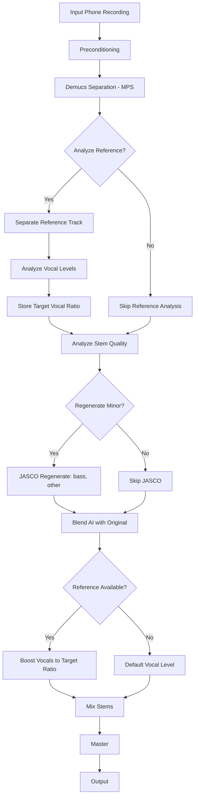

# MPS Fix and JASCO Enhancement Plan

## Overview

Fix MPS acceleration support and create an enhanced AI remaster script that uses JASCO for "minor" damage stems while also addressing vocal drowning issues.

## Current Issues

### Issue 1: MPS Detection Fails
**File:** `Resonate/audio_engine/device.py`

The error `module 'torch.mps' has no attribute 'get_device_name'` causes MPS detection to fail, forcing CPU usage.

```python
# Line 73 - INVALID (no MPS equivalent):
torch.mps.get_device_name(0)  # ❌ DOES NOT EXIST

# Line 71 - VALID:
torch.mps.set_per_process_memory_fraction(self.memory_fraction)  # ✅ EXISTS
```

**Valid MPS API:**
| Function | Exists | Purpose |
|----------|--------|---------|
| `torch.backends.mps.is_available()` | ✅ | Check if MPS hardware is available |
| `torch.backends.mps.is_built()` | ✅ | Check if PyTorch was built with MPS |
| `torch.mps.empty_cache()` | ✅ | Clear MPS memory cache |
| `torch.mps.synchronize()` | ✅ | Wait for MPS operations |
| `torch.mps.set_per_process_memory_fraction()` | ✅ | Set memory limit |
| `torch.mps.get_device_name()` | ❌ | **DOES NOT EXIST** |

### Issue 2: Separator Forces CPU
**File:** `Resonate/audio_engine/separator.py` (lines 189-196)

```python
if device_str == 'mps':
    logger.info("Using CPU for Demucs (MPS can be unstable)")
    self._model = self._model.cpu()  # ← FORCES CPU!
```

This intentionally forces CPU even when MPS works, causing ~86 min processing instead of ~5-10 min.

### Issue 3: JASCO Regeneration Never Triggers for Minor Damage
**File:** `Resonate/audio_engine/profiling/quality_detector.py` (lines 340-341)

```python
if damage_level in [DamageLevel.GOOD, DamageLevel.MINOR]:
    return False, []  # needs_regeneration is ALWAYS False!
```

**File:** `Resonate/tools/run_studio_ai_remaster.py` (lines 362-366)

```python
if report.get('needs_regeneration', False):  # Always False for minor
    damage = report.get('distortion_score', 0) + report.get('noise_score', 0)
    if damage > self.regenerate_threshold:
        stems_to_regen.append(name)
```

So stems with "minor" damage **never** get regenerated with JASCO.

### Issue 4: Vocals Drowned Out
From analysis:
- vocals: SNR=15.8 dB (good)
- bass: SNR=1.8 dB (poor - mostly noise!)
- other: SNR=8.5 dB (mediocre)

The poor bass SNR may cause mixing issues. Also, no reference track vocal analysis is performed for level matching.

---

## Implementation Plan

### Phase A: Fix MPS Support

#### Task A1: Fix device.py
**File:** `Resonate/audio_engine/device.py`

Replace lines 71-74:
```python
# BEFORE:
torch.mps.set_per_process_memory_fraction(self.memory_fraction)
logger.info(f"✅ Using MPS (Metal) device: {torch.mps.get_device_name(0)}")

# AFTER:
torch.mps.set_per_process_memory_fraction(self.memory_fraction)
logger.info(f"✅ Using MPS (Metal) device: Apple Silicon GPU")
logger.info(f"   Memory fraction: {self.memory_fraction * 100}%")
```

Replace lines 102-107 in get_info():
```python
# BEFORE:
info["gpu_name"] = torch.mps.get_device_name(0)

# AFTER:
info["gpu_name"] = "Apple Silicon MPS"
```

#### Task A2: Enable MPS in separator.py
**File:** `Resonate/audio_engine/separator.py`

Replace lines 189-196:
```python
# BEFORE:
if device_str == 'mps':
    logger.info("Using CPU for Demucs (MPS can be unstable)")
    self._model = self._model.cpu()

# AFTER:
if device_str == 'mps':
    try:
        # Try MPS first
        self._model = self._model.to('mps')
        logger.info("✅ Using MPS (Apple Silicon GPU) for Demucs")
    except Exception as mps_err:
        # Fall back to CPU if MPS fails
        logger.warning(f"MPS failed: {mps_err}, falling back to CPU")
        self._model = self._model.cpu()
```

#### Task A3: Add environment variable fallback
Allow `PYTORCH_ENABLE_MPS_FALLBACK=1` for operations not supported on MPS.

---

### Phase B: Enhanced AI Remaster Script

#### Task B1: Create new script with forced JASCO support
**File:** `Resonate/tools/run_studio_ai_remaster_v2.py`

New features:
1. `--regenerate-minor` flag to force regeneration of "minor" damage stems
2. `--force-jasco` flag to use JASCO for all stems regardless of damage
3. `--vocal-boost` flag to boost vocal presence
4. Reference vocal analysis for level matching

#### Task B2: Add reference vocal analysis
In the new script, analyze the reference track's vocal stem:
```python
def analyze_reference_vocals(self, reference_path: str, sr: int) -> Dict:
    """Separate reference and analyze vocal levels."""
    # Separate reference
    ref_stems = self.separate_stems(ref_audio, sr)
    
    # Analyze vocal stem
    vocal_rms = np.sqrt(np.mean(ref_stems['vocals'] ** 2))
    vocal_peak = np.max(np.abs(ref_stems['vocals']))
    
    return {
        'vocal_rms': vocal_rms,
        'vocal_peak': vocal_peak,
        'vocal_ratio': vocal_rms / mix_rms  # Relative level
    }
```

#### Task B3: Add vocal presence boost
Apply gain to vocals to match reference levels:
```python
def boost_vocal_presence(self, stems: Dict, target_ratio: float) -> Dict:
    """Boost vocals to match target ratio."""
    mix_rms = self._compute_mix_rms(stems)
    current_ratio = np.sqrt(np.mean(stems['vocals'] ** 2)) / mix_rms
    
    gain = target_ratio / current_ratio
    gain = np.clip(gain, 0.5, 2.0)  # Limit gain range
    
    stems['vocals'] = stems['vocals'] * gain
    return stems
```

---

### Phase C: Fix Quality Detector for Minor Damage

#### Task C1: Add force_regenerate option
**File:** `Resonate/audio_engine/profiling/quality_detector.py`

Add parameter to bypass damage level check:
```python
def _detect_regeneration_regions(self, audio: np.ndarray, sample_rate: int,
                                  damage_level: DamageLevel,
                                  clipping_score: float,
                                  artifact_score: float,
                                  force_regenerate: bool = False) -> Tuple[bool, List]:
    
    if not force_regenerate and damage_level in [DamageLevel.GOOD, DamageLevel.MINOR]:
        return False, []
    
    # Continue with region detection...
```

---

## Pipeline Flow with Enhancements



---

## Command Line Interface

### New flags for enhanced script:

```bash
python tools/run_studio_ai_remaster_v2.py <input> \
  --reference <reference_file> \
  --regenerate-minor \
  --vocal-boost 1.2 \
  --blend 0.4 \
  --target-lufs -14.0
```

| Flag | Description | Default |
|------|-------------|---------|
| `--regenerate-minor` | Regenerate stems with "minor" damage | False |
| `--force-jasco` | Regenerate ALL stems with JASCO | False |
| `--vocal-boost` | Vocal gain multiplier | 1.0 |
| `--reference` | Reference track for analysis | None |
| `--blend` | AI blend ratio 0-1 | 0.3 |

---

## Success Criteria

1. **MPS Works**: Processing time reduced from ~86 min to ~5-10 min
2. **JASCO Used**: Minor damage stems are regenerated
3. **Vocals Clear**: Vocals are not drowned out after build-up
4. **Reference Matching**: Output vocal levels match reference track

---

## Testing Plan

1. Run `python -c "import torch; print(torch.backends.mps.is_available())"` - should be True
2. Run AI remaster without `--force-cpu` and verify MPS is used
3. Run with `--regenerate-minor` and verify bass/other are regenerated
4. Compare vocal levels with reference track

---

## Files to Modify

| File | Changes |
|------|---------|
| `Resonate/audio_engine/device.py` | Remove invalid `get_device_name()` call |
| `Resonate/audio_engine/separator.py` | Enable MPS with fallback |
| `Resonate/tools/run_studio_ai_remaster_v2.py` | New enhanced script |
| `Resonate/audio_engine/profiling/quality_detector.py` | Add force_regenerate option |
