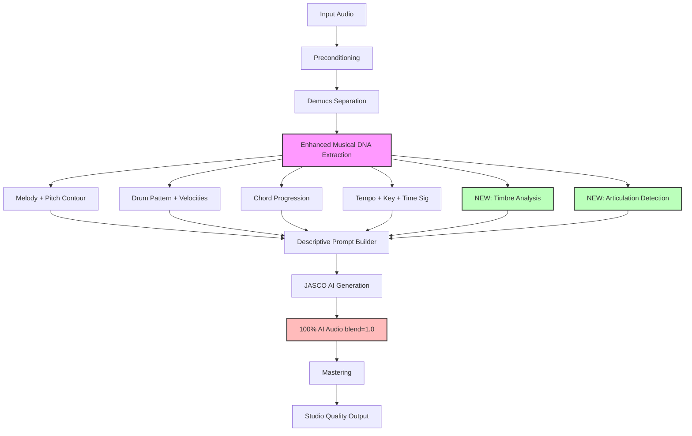

# Taylor's Version: Full AI Rerecording Plan

## Overview

Create a "Taylor's Version" mode that generates a studio-quality AI rerecording of the entire song, maintaining maximum similarity to the original while using AI-generated instruments.

**Goal**: Input a rough recording → Output a studio-quality "cover version" that sounds like the original artist re-recorded it professionally.

---

## Current State vs. Target

### What We Have ✅
- Demucs source separation (vocals, drums, bass, other)
- MusicGen/JASCO AI generation with conditioning
- Melody extraction (pitch contours)
- Drum pattern extraction (onsets, kick/snare/hihat)
- Chord progression extraction
- Tempo/key detection
- Genre-aware prompting (future_rave, tech_house, etc.)
- Conditioned chunking (30s windows with crossfade)
- `--force-jasco` flag (regenerates all stems)
- Blend ratio control (0-1, currently defaults to 0.3-0.4)

### What We Need ➕
1. **100% AI Regeneration Mode** (blend=1.0, no original audio mixed in)
2. **Enhanced Conditioning** for maximum similarity:
   - Timbre/tone descriptors (voice quality, instrument types)
   - Articulation details (vibrato, slides, dynamics)
   - Spectral characteristics (brightness, warmth)
3. **Vocal Cloning Hints** (text descriptions of vocal style)
4. **New Script**: `run_taylors_version_rerecord.py`
5. **Quality Comparison Metrics** (similarity to original)

---

## Architecture: Taylor's Version Mode



---

## Implementation Plan

### Phase 1: Enhanced Musical DNA Extraction

#### Task 1.1: Create Timbre Analyzer
**File**: `Resonate/audio_engine/profiling/timbre_analyzer.py`

**Purpose**: Analyze spectral characteristics to generate descriptive prompts.

**Features**:
```python
@dataclass
class TimbreProfile:
    brightness: float  # Spectral centroid (0-1)
    warmth: float  # Low-frequency energy (0-1)
    harshness: float  # High-frequency distortion (0-1)
    breathiness: float  # Noise content (0-1, for vocals)
    texture_description: str  # "bright", "warm", "harsh", "breathy", etc.

class TimbreAnalyzer:
    def analyze(self, audio: np.ndarray, sr: int, stem_type: str) -> TimbreProfile
    def to_description(self, profile: TimbreProfile, stem_type: str) -> str
```

**Algorithm**:
- Spectral centroid → brightness
- Energy <500Hz → warmth
- Harmonic-to-noise ratio → texture
- Zero-crossing rate → harshness

**Example Output**:
- Vocals: "bright female soprano, breathy tone, emotional delivery"
- Drums: "tight punchy kick, crisp snare, bright hi-hats"
- Bass: "deep warm sub bass, rolling rhythm"

---

#### Task 1.2: Create Articulation Detector
**File**: `Resonate/audio_engine/profiling/articulation_detector.py`

**Purpose**: Detect expressive musical details.

**Features**:
```python
@dataclass
class ArticulationProfile:
    vibrato_detected: bool
    vibrato_rate_hz: float
    pitch_bends: List[Tuple[float, float]]  # (time, bend_cents)
    dynamic_range_db: float
    attack_time_ms: float
    articulation_description: str

class ArticulationDetector:
    def detect(self, audio: np.ndarray, sr: int, stem_type: str) -> ArticulationProfile
    def to_description(self, profile: ArticulationProfile) -> str
```

**Algorithm**:
- Vibrato: detect periodic pitch modulation (4-8 Hz)
- Pitch bends: track F0 deviation >50 cents
- Dynamic range: RMS envelope variance
- Attack time: onset slope analysis

**Example Output**:
- "expressive vibrato, smooth legato phrasing, wide dynamic range"
- "staccato rhythm, sharp attacks, punchy groove"

---

#### Task 1.3: Enhance Prompt Builder
**File**: Update `Resonate/audio_engine/generation/jasco_generator.py`

Add new method:
```python
def _build_enhanced_description(
    self,
    stem_type: str,
    melody: MelodyConditioning,
    drums: DrumConditioning,
    chords: ChordConditioning,
    tempo: TempoConditioning,
    timbre: TimbreProfile,  # NEW
    articulation: ArticulationProfile,  # NEW
    genre: str
) -> str:
    """Build highly detailed prompt for maximum similarity."""
    
    # Combine all conditioning into rich description
    # Example: "studio acapella, bright female soprano voice, expressive vibrato, 
    #           emotional delivery, following C-G-Am-F progression at 120 BPM"
```

---

### Phase 2: Create Taylor's Version Script

#### Task 2.1: New Script - `run_taylors_version_rerecord.py`
**File**: `Resonate/tools/run_taylors_version_rerecord.py`

**Features**:
- Inherits from `StudioAIRemasterV2`
- Automatically sets: `force_jasco=True`, `blend=1.0`
- Uses enhanced extractors (timbre, articulation)
- More detailed prompts per stem
- Per-stem quality comparison metrics

**Key Differences from V2**:
| Feature | V2 (Repair Mode) | Taylor's Version |
|---------|------------------|------------------|
| Blend Ratio | 0.3-0.4 (mostly original) | 1.0 (100% AI) |
| Regeneration | Only damaged stems | ALL stems |
| Conditioning | Basic (melody/drums) | Enhanced (timbre/articulation) |
| Prompts | Generic quality | Detailed descriptive |
| Goal | Fix damage | Full rerecording |

**New Flags**:
```bash
--taylors-version        # Enable full rerecord mode
--similarity-target      # Target similarity score (0-1, default 0.85)
--max-iterations         # Iterative refinement attempts (default 1)
--timbre-matching        # Match spectral characteristics (default True)
--articulation-matching  # Match expressive details (default True)
```

---

#### Task 2.2: Similarity Comparison Metrics
**File**: `Resonate/audio_engine/metrics.py` (enhance existing)

Add new metrics:
```python
@dataclass
class SimilarityMetrics:
    """Compare AI output to original."""
    
    spectral_similarity: float  # 0-1, STFT correlation
    melodic_similarity: float   # 0-1, pitch contour match
    rhythmic_similarity: float  # 0-1, onset timing match
    timbral_similarity: float   # 0-1, MFCCs correlation
    overall_similarity: float   # Weighted average
    
    def is_acceptable(self, threshold: float = 0.85) -> bool
```

**Algorithm**:
- Spectral: Cosine similarity between STFTs
- Melodic: Dynamic Time Warping on F0 sequences
- Rhythmic: Cross-correlation of onset envelopes
- Timbral: MFCC distance

---

### Phase 3: Iterative Refinement (Optional Advanced Feature)

#### Task 3.1: Feedback Loop
If similarity < threshold:
1. Analyze what's different (frequency mismatch, timing issues, etc.)
2. Adjust prompts ("more bass", "faster attack", etc.)
3. Regenerate with updated prompts
4. Repeat until similarity acceptable or max iterations reached

**Implementation**:
```python
def refine_generation(
    original_stem: np.ndarray,
    generated_stem: np.ndarray,
    profile: Dict[str, Any],
    max_iterations: int = 3
) -> np.ndarray:
    """Iteratively refine generation until similarity acceptable."""
    
    for iteration in range(max_iterations):
        metrics = compute_similarity(original_stem, generated_stem)
        
        if metrics.overall_similarity >= 0.85:
            break
        
        # Adjust prompts based on differences
        adjusted_prompt = adjust_prompt_from_metrics(profile, metrics)
        
        # Regenerate
        generated_stem = regenerate_with_prompt(adjusted_prompt)
    
    return generated_stem
```

---

### Phase 4: UI Integration

#### Task 4.1: Add "Taylor's Version Mode" Toggle
**File**: `Resonate/ui/app.py`

Add new sidebar section:
```python
st.subheader("🎙️ Taylor's Version Rerecording")
st.caption("Full AI rerecording for studio quality")

taylors_version = st.toggle(
    "Enable Taylor's Version Mode",
    value=False,
    help="100% AI regeneration of all stems (no original audio blended)"
)

if taylors_version:
    similarity_target = st.slider(
        "Similarity Target",
        min_value=0.7,
        max_value=0.95,
        value=0.85,
        help="How closely to match the original (0.85 = very close)"
    )
    
    max_iterations = st.number_input(
        "Max Refinement Iterations",
        min_value=1,
        max_value=5,
        value=1,
        help="Attempt to improve similarity (1 = single pass)"
    )
    
    enable_timbre_match = st.toggle("Timbre Matching", value=True)
    enable_articulation_match = st.toggle("Articulation Matching", value=True)
```

---

## Example Usage

### Command Line

```bash
# Full AI rerecording (Taylor's Version)
python tools/run_taylors_version_rerecord.py \
  "Shadows John Summit Unreleased.mp3" \
  --genre "tech_house,future_rave" \
  --similarity-target 0.85 \
  --timbre-matching \
  --articulation-matching \
  --vocal-boost 1.0

# Compare to existing V2 (blend mode):
python tools/run_studio_ai_remaster_v2.py \
  "Shadows John Summit Unreleased.mp3" \
  --force-jasco \
  --blend 0.4  # Still mixes 60% original
```

### UI

1. Upload "Shadows John Summit Unreleased.mp3"
2. Enable "Taylor's Version Mode" toggle
3. Set genre: "tech_house, future_rave"
4. Set similarity target: 0.85
5. Click "Rerecord with AI"
6. Wait for processing
7. Download "Shadows_taylors_version.wav"

---

## File Structure After Implementation

```
Resonate/
├── audio_engine/
│   ├── profiling/
│   │   ├── melody_extractor.py       ✅ Exists
│   │   ├── drum_pattern_extractor.py ✅ Exists
│   │   ├── chord_extractor.py        ✅ Exists
│   │   ├── tempo_key_analyzer.py     ✅ Exists
│   │   ├── timbre_analyzer.py        ➕ NEW
│   │   └── articulation_detector.py  ➕ NEW
│   │
│   ├── generation/
│   │   ├── jasco_generator.py        ✏️ Enhance _build_description()
│   │   └── ...
│   │
│   └── metrics.py                    ✏️ Add SimilarityMetrics
│
├── tools/
│   ├── run_studio_ai_remaster_v2.py  ✅ Exists (blend mode)
│   └── run_taylors_version_rerecord.py ➕ NEW (100% AI mode)
│
└── ui/
    └── app.py                        ✏️ Add Taylor's Version toggle
```

---

## Success Criteria

After implementation, verify:

1. **Similarity**: AI output scores >0.85 similarity to original
2. **Quality**: Output is studio-quality (no artifacts, proper levels)
3. **Structure**: Melody, rhythm, harmony match original closely
4. **Timbre**: Instruments sound appropriate (not random genre mismatch)
5. **Preservation**: Existing `run_studio_ai_remaster_v2.py` still works
6. **UI**: Taylor's Version toggle works in Streamlit UI

---

## Testing Plan

### Test 1: Vocal Similarity
- Input: Phone recording of vocals
- Expected: AI vocals follow same melody, similar tone, ~85%+ similarity

### Test 2: Drum Pattern Accuracy
- Input: EDM track with complex drum pattern
- Expected: AI drums hit same beats, similar timing

### Test 3: Full Song Rerecording
- Input: "Shadows John Summit Unreleased.mp3"
- Expected: Studio-quality output that sounds like a professional cover

### Test 4: Genre Consistency
- Input: Tech house track
- Expected: Output maintains tech house style (not random genre)

---

## Limitations & Trade-offs

**What Taylor's Version Mode CAN Do:**
✅ Create a studio-quality "cover version" that closely follows the original
✅ Maintain melody, harmony, rhythm, and structure
✅ Apply genre-appropriate instruments and mixing
✅ Remove noise, distortion, and damage completely

**What It CANNOT Do:**
❌ Clone the exact voice of the original singer (not voice cloning)
❌ Recreate the exact same performance (it's generative, not reconstructive)
❌ Match 100% perfectly (will always have some differences, like Taylor's versions)
❌ Preserve every subtle nuance (some expressive details may be lost)

**Expected Similarity**: 80-90% (similar to how Taylor's Version sounds very close but not identical)

---

## Priority Order

1. **Task 1.1**: Create Timbre Analyzer (foundation for descriptive prompts)
2. **Task 1.2**: Create Articulation Detector (adds expressive detail)
3. **Task 1.3**: Enhance Prompt Builder (integrates new extractors)
4. **Task 2.1**: Create `run_taylors_version_rerecord.py` (main script)
5. **Task 2.2**: Add Similarity Metrics (quality validation)
6. **Task 4.1**: Add UI Toggle (user-facing feature)
7. **Task 3.1**: Iterative Refinement (advanced, optional)

---

## Dependencies

**Already Installed:**
- audiocraft (MusicGen)
- librosa (audio analysis)
- numpy, scipy
- torch (for MPS/GPU)

**May Need:**
- `crepe` or `pyin` for better pitch tracking (optional, librosa has this)
- `madmom` for better onset detection (optional, librosa works)

---

## Notes

- This mode is complementary to existing repair mode
- Use V2 (`--blend 0.3`) when you want to preserve original audio
- Use Taylor's Version (`--blend 1.0`) when you want full AI rerecording
- The blend parameter is the key difference: 0.3 = repair, 1.0 = rerecord
