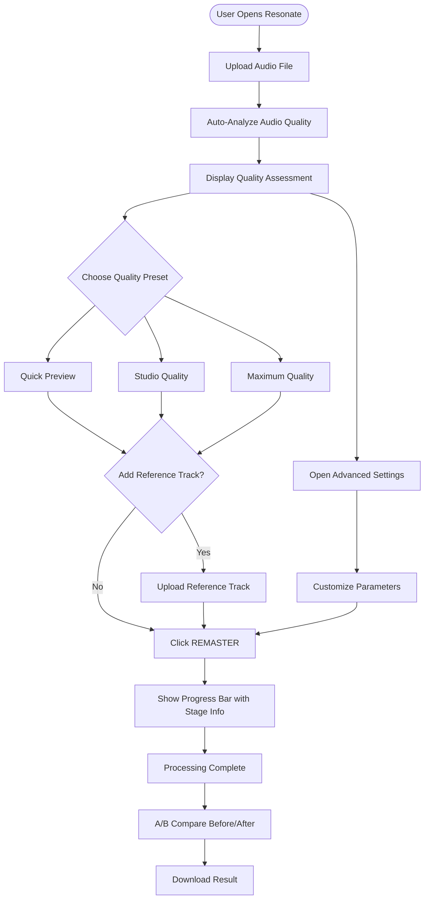

# Resonate UI Redesign Specification

## Overview

This document specifies a simplified UI redesign for Resonate that maintains the full functionality of the current 1700+ line `app.py` while presenting a streamlined interface inspired by the proven CLI workflow in `run_studio_ai_remaster.py` and `run_studio_ai_remaster_v2.py`.

### Design Principles

1. **Progressive Disclosure** - Simple by default, complexity available when needed
2. **Sensible Defaults** - Works great out of the box using proven values from canon scripts
3. **Clear Feedback** - Users always know what's happening and what to do next
4. **Minimal Decisions** - Reduce cognitive load; presets handle complexity

---

## 1. User Flow Diagram



---

## 2. Main Interface Layout

### 2.1 Primary View Structure

```
┌─────────────────────────────────────────────────────────────────┐
│  🎵 Resonate - Live Music Reconstruction                        │
│  Transform phone recordings into studio-quality audio           │
├─────────────────────────────────────────────────────────────────┤
│                                                                 │
│  ┌─────────────────────────────────────────────────────────┐   │
│  │  📁 UPLOAD YOUR RECORDING                                │   │
│  │  ┌─────────────────────────────────────────────────────┐│   │
│  │  │                                                     ││   │
│  │  │     Drag and drop audio file here                   ││   │
│  │  │     or click to browse                              ││   │
│  │  │                                                     ││   │
│  │  │     Supports: WAV, MP3, FLAC, OGG, M4A              ││   │
│  │  └─────────────────────────────────────────────────────┘│   │
│  └─────────────────────────────────────────────────────────┘   │
│                                                                 │
│  ┌─────────────────────────────────────────────────────────┐   │
│  │  🎯 REFERENCE TRACK (Optional but Recommended)          │   │
│  │  Upload a professionally mixed track in the same genre  │   │
│  │  to match its sound characteristics                     │   │
│  │  ┌─────────────────────────────────────────────────────┐│   │
│  │  │     + Add Reference Track                           ││   │
│  │  └─────────────────────────────────────────────────────┘│   │
│  └─────────────────────────────────────────────────────────┘   │
│                                                                 │
│  ┌─────────────────────────────────────────────────────────┐   │
│  │  ⚡ QUALITY PRESET                                       │   │
│  │                                                         │   │
│  │  ○ Quick Preview    - Fast results, good quality       │   │
│  │  ● Studio Quality   - Balanced speed and quality       │   │
│  │  ○ Maximum Quality  - Best results, slower processing  │   │
│  │                                                         │   │
│  │  [▼ Advanced Settings]                                  │   │
│  └─────────────────────────────────────────────────────────┘   │
│                                                                 │
│  ┌─────────────────────────────────────────────────────────┐   │
│  │                   🚀 REMASTER                            │   │
│  └─────────────────────────────────────────────────────────┘   │
│                                                                 │
└─────────────────────────────────────────────────────────────────┘
```

### 2.2 After Upload - Quality Assessment Display

```
┌─────────────────────────────────────────────────────────────────┐
│  📊 AUDIO QUALITY ASSESSMENT                                    │
├─────────────────────────────────────────────────────────────────┤
│                                                                 │
│  Your Recording: concert_recording.mp3                          │
│  Duration: 3:42  |  Sample Rate: 44.1kHz  |  Channels: Stereo  │
│                                                                 │
│  ┌──────────────┬──────────────┬──────────────┬─────────────┐  │
│  │  🟡 MINOR    │  🟢 GOOD     │  🟠 MODERATE │  🟢 GOOD    │  │
│  │  Clipping    │  Distortion  │  Noise       │  Dynamics   │  │
│  │  12%         │  8%          │  35%         │  Low        │  │
│  └──────────────┴──────────────┴──────────────┴─────────────┘  │
│                                                                 │
│  💡 Recommendation: Use Studio Quality preset for best results │
│                                                                 │
└─────────────────────────────────────────────────────────────────┘
```

### 2.3 Processing Progress Display

```
┌─────────────────────────────────────────────────────────────────┐
│  ⏳ PROCESSING YOUR AUDIO                                       │
├─────────────────────────────────────────────────────────────────┤
│                                                                 │
│  ████████████████░░░░░░░░░░░░░░░░░░░░░░  45%                   │
│                                                                 │
│  Stage 3 of 6: Analyzing stems for damage...                   │
│                                                                 │
│  ✅ Step 1: Pre-conditioning (cleaned audio)                   │
│  ✅ Step 2: Source separation (extracted 4 stems)              │
│  ⏳ Step 3: Quality analysis                                   │
│  ○ Step 4: AI enhancement (if needed)                          │
│  ○ Step 5: Mixing                                              │
│  ○ Step 6: Mastering                                           │
│                                                                 │
└─────────────────────────────────────────────────────────────────┘
```

### 2.4 Results and A/B Comparison

```
┌─────────────────────────────────────────────────────────────────┐
│  ✅ REMASTERING COMPLETE                                        │
├─────────────────────────────────────────────────────────────────┤
│                                                                 │
│  ┌─────────────────────────┬─────────────────────────┐         │
│  │      ORIGINAL           │      REMASTERED         │         │
│  │  ▶ [waveform]           │  ▶ [waveform]           │         │
│  │                         │                         │         │
│  │  SNR: 12.3 dB           │  SNR: 24.1 dB (+11.8)  │         │
│  │  Loudness: -22 LUFS     │  Loudness: -14 LUFS    │         │
│  │  Clipping: 12%          │  Clipping: 0%          │         │
│  └─────────────────────────┴─────────────────────────┘         │
│                                                                 │
│  ┌───────────────────────────────────────────────────┐         │
│  │  🔄 A/B Toggle: [Original] [Remastered]           │         │
│  │                                                   │         │
│  │  ▶ ───●────────────────────────────── 0:00/3:42   │         │
│  └───────────────────────────────────────────────────┘         │
│                                                                 │
│  ┌─────────────────────────────────────────────────────────┐   │
│  │              ⬇️ DOWNLOAD REMASTERED AUDIO               │   │
│  └─────────────────────────────────────────────────────────┘   │
│                                                                 │
│  [Process Another] [Export Stems] [View Detailed Report]       │
│                                                                 │
└─────────────────────────────────────────────────────────────────┘
```

---

## 3. Preset System

### 3.1 Preset Definitions

All presets use the proven parameter values from the canon scripts.

#### Quick Preview
**Use case:** Fast iteration, testing different reference tracks
```python
PRESET_QUICK_PREVIEW = {
    # Pipeline mode
    'mode': PipelineMode.PREVIEW,
    
    # Preconditioning - lighter touch
    'enable_preconditioning': True,
    'precondition_noise_strength': 0.2,
    'precondition_declip': True,
    'precondition_dynamics': False,
    
    # Separation
    'separation_model': 'htdemucs',  # Faster model
    
    # Enhancement
    'enhancement_intensity': 0.3,
    
    # Restoration
    'frequency_restoration': False,
    'dereverberation': False,
    
    # Polish
    'enable_mbd_polish': False,
    
    # Regeneration
    'enable_regeneration': False,  # Skip JASCO
    
    # Mastering
    'target_loudness_lufs': -14.0,
    'enable_compression': True,
    'enable_eq_matching': True,
    
    # Output
    'output_format': 'mp3',  # Smaller files for preview
}
```

#### Studio Quality (Default)
**Use case:** Balanced quality and processing time
```python
PRESET_STUDIO_QUALITY = {
    # Pipeline mode
    'mode': PipelineMode.RENDER,
    
    # Preconditioning - from canon script defaults
    'enable_preconditioning': True,
    'precondition_noise_strength': 0.3,  # Canon default
    'precondition_declip': True,
    'precondition_dynamics': True,
    
    # Separation
    'separation_model': 'htdemucs_ft',  # Canon default
    
    # Enhancement
    'enhancement_intensity': 0.5,
    
    # Restoration
    'frequency_restoration': True,
    'frequency_intensity': 0.5,
    'dereverberation': True,
    'dereverb_intensity': 0.3,
    
    # Polish
    'enable_mbd_polish': False,  # Skip unless needed
    
    # Regeneration - auto-detect
    'enable_regeneration': True,
    'regenerate_threshold': 0.5,  # Canon default
    'regenerate_minor': False,
    'blend_ratio': 0.3,  # Canon default - 30% AI, 70% original
    'jasco_model': 'medium',
    
    # Mastering
    'target_loudness_lufs': -14.0,  # Canon default
    'enable_compression': True,
    'enable_eq_matching': True,
    
    # Output
    'output_format': 'wav',
}
```

#### Maximum Quality
**Use case:** Best possible results, time is not a concern
```python
PRESET_MAXIMUM_QUALITY = {
    # Pipeline mode
    'mode': PipelineMode.RENDER,
    
    # Preconditioning - thorough
    'enable_preconditioning': True,
    'precondition_noise_strength': 0.5,
    'precondition_declip': True,
    'precondition_dynamics': True,
    
    # Separation
    'separation_model': 'htdemucs_ft',
    
    # Enhancement
    'enhancement_intensity': 0.7,
    
    # Restoration
    'frequency_restoration': True,
    'frequency_intensity': 0.7,
    'dereverberation': True,
    'dereverb_intensity': 0.5,
    
    # Polish
    'enable_mbd_polish': True,
    'mbd_intensity': 0.3,
    
    # Regeneration - more aggressive
    'enable_regeneration': True,
    'regenerate_threshold': 0.3,  # Lower threshold = regenerate more
    'regenerate_minor': True,  # Also fix minor damage
    'blend_ratio': 0.4,  # More AI influence
    'jasco_model': 'large',  # Best quality
    
    # Mastering
    'target_loudness_lufs': -14.0,
    'enable_compression': True,
    'enable_eq_matching': True,
    
    # Output
    'output_format': 'wav',
}
```

### 3.2 Preset Selection UI Behavior

When a user selects a preset:
1. All parameters are set to preset values
2. Advanced Settings panel shows current values (collapsed by default)
3. User can still modify individual settings (becomes "Custom" preset)

---

## 4. Advanced Settings Organization

### 4.1 Categories

Advanced settings are organized into collapsible sections with clear, non-technical labels.

```
▼ Advanced Settings
├── ▶ Input Cleaning
├── ▶ Audio Separation  
├── ▶ Restoration & Enhancement
├── ▶ AI Regeneration
├── ▶ Final Mastering
└── ▶ Output Options
```

### 4.2 Setting Details by Category

#### Input Cleaning (Pre-conditioning)
| Setting | User Label | Control | Default | Range | Help Text |
|---------|-----------|---------|---------|-------|-----------|
| `precondition_noise_strength` | Noise Reduction | Slider | 0.3 | 0-1 | How much background noise to remove. Higher = cleaner but may affect music quality. |
| `precondition_declip` | Fix Distorted Peaks | Toggle | On | - | Repair audio that was too loud for the phone microphone. |
| `precondition_dynamics` | Restore Dynamics | Toggle | On | - | Undo the automatic volume adjustments phones make. |

#### Audio Separation
| Setting | User Label | Control | Default | Range | Help Text |
|---------|-----------|---------|---------|-------|-----------|
| `separation_model` | Separation Quality | Dropdown | htdemucs_ft | htdemucs, htdemucs_ft, htdemucs_6s | Higher quality = slower but better stem separation. |

#### Restoration & Enhancement
| Setting | User Label | Control | Default | Range | Help Text |
|---------|-----------|---------|---------|-------|-----------|
| `enhancement_intensity` | Enhancement Strength | Slider | 0.5 | 0-1 | How much to enhance clarity and presence of each instrument. |
| `frequency_restoration` | Extend Frequency Range | Toggle | On | - | Restore bass and treble lost in phone recordings. |
| `frequency_intensity` | Frequency Restoration Amount | Slider | 0.5 | 0-1 | How much frequency extension to apply. |
| `dereverberation` | Reduce Room Echo | Toggle | On | - | Remove venue acoustics and reverb. |
| `dereverb_intensity` | Echo Reduction Amount | Slider | 0.3 | 0-1 | How much reverb to remove. Higher may sound unnatural. |
| `enable_mbd_polish` | Neural Audio Polish | Toggle | Off | - | Use AI to reduce remaining artifacts. Adds processing time. |
| `mbd_intensity` | Polish Intensity | Slider | 0.3 | 0-1 | How much AI polishing to apply. |

#### AI Regeneration
| Setting | User Label | Control | Default | Range | Help Text |
|---------|-----------|---------|---------|-------|-----------|
| `enable_regeneration` | Enable AI Stem Repair | Toggle | On | - | Use JASCO AI to regenerate heavily damaged parts. |
| `regenerate_threshold` | Damage Threshold | Slider | 0.5 | 0-1 | How damaged a stem must be before AI repairs it. Lower = repair more. |
| `regenerate_minor` | Also Repair Minor Damage | Toggle | Off | - | Repair stems with only minor damage too. |
| `blend_ratio` | AI Blend Amount | Slider | 0.3 | 0-1 | Balance between original and AI-repaired audio. 0.3 = subtle, 0.7 = significant. |
| `jasco_model` | AI Model Size | Dropdown | medium | small, medium, large | Larger = better quality but slower. |
| `style_description` | Style Description | Text | empty | - | Optional: Describe the music style to guide AI. e.g., "funky rock" |

#### Final Mastering
| Setting | User Label | Control | Default | Range | Help Text |
|---------|-----------|---------|---------|-------|-----------|
| `target_loudness_lufs` | Target Loudness | Dropdown | -14 LUFS | -16, -14, -12, -10 | Standard loudness for streaming platforms. |
| `enable_compression` | Apply Compression | Toggle | On | - | Smooth out volume differences for consistent loudness. |
| `enable_eq_matching` | Match Reference EQ | Toggle | On | - | Adjust tone to match reference track if provided. |

#### Output Options
| Setting | User Label | Control | Default | Range | Help Text |
|---------|-----------|---------|---------|-------|-----------|
| `output_format` | Output Format | Dropdown | WAV | WAV, FLAC, MP3 | WAV = highest quality, MP3 = smallest file. |

---

## 5. Reference Track Feature

### 5.1 Reference Track Upload

The reference track section should be prominently displayed because it significantly improves results.

```
┌─────────────────────────────────────────────────────────────────┐
│  🎯 REFERENCE TRACK                                             │
│                                                                 │
│  A reference track is a professionally mixed song in a similar │
│  style. Resonate will analyze it and match your recording's    │
│  tonal balance, vocal presence, and loudness to it.            │
│                                                                 │
│  ┌─────────────────────────────────────────────────────────┐   │
│  │  + Add Reference Track (MP3, WAV, FLAC)                 │   │
│  └─────────────────────────────────────────────────────────┘   │
│                                                                 │
│  💡 Tip: Choose a song with similar genre and instrumentation  │
│                                                                 │
└─────────────────────────────────────────────────────────────────┘
```

### 5.2 Reference Analysis Display (After Upload)

```
┌─────────────────────────────────────────────────────────────────┐
│  🎯 REFERENCE: Catch My Breath - Kelly Clarkson                │
│                                                                 │
│  Analysis Results:                                              │
│  ├── Vocal Presence: Strong (35%)                              │
│  ├── Spectral Balance: Bright (+2.1 dB above neutral)          │
│  └── Duration: 3:56                                            │
│                                                                 │
│  ✅ Good match for your recording style                        │
│                                                                 │
│  [Change Reference] [Remove]                                   │
└─────────────────────────────────────────────────────────────────┘
```

### 5.3 Reference Track Behavior

From `run_studio_ai_remaster_v2.py`, reference track analysis:
1. Separates reference to extract vocal stem
2. Calculates vocal-to-mix ratio
3. Analyzes spectral centroid
4. Uses these to adjust target track vocal levels and EQ

---

## 6. Progress and Feedback System

### 6.1 Processing Stages

Display these human-readable stage names:

| Internal Stage | User-Facing Name | Description |
|---------------|------------------|-------------|
| preconditioning | Cleaning audio | Removing noise and fixing distortion |
| separation | Separating instruments | Extracting vocals, drums, bass, and other |
| analysis | Analyzing quality | Detecting damage in each stem |
| regeneration | AI enhancement | Repairing damaged sections |
| mixing | Mixing stems | Combining enhanced instruments |
| mastering | Final mastering | Optimizing loudness and tone |

### 6.2 Progress Feedback Requirements

1. **Overall Progress Bar** - 0-100% with current stage name
2. **Stage Checklist** - Shows completed, current, and pending stages
3. **Estimated Time** - Optional, based on file duration and preset
4. **Cancel Button** - Allow user to stop processing
5. **Error Handling** - Clear error messages with suggested actions

---

## 7. A/B Comparison System

### 7.1 Simplified Comparison UI

Replace complex current comparison with simple toggle:

```
┌─────────────────────────────────────────────────────────────────┐
│                                                                 │
│     ┌─────────────┐  ┌─────────────┐                           │
│     │  ORIGINAL   │  │ REMASTERED  │  ← Toggle buttons         │
│     └─────────────┘  └─────────────┘                           │
│                                                                 │
│     ▶ ────────●───────────────────────── 1:24 / 3:42          │
│                                                                 │
│     Currently playing: REMASTERED                              │
│                                                                 │
└─────────────────────────────────────────────────────────────────┘
```

### 7.2 Quick Metrics Display

Show key improvements at a glance:

```
┌────────────┬────────────┬────────────┐
│ SNR        │ Clarity    │ Loudness   │
│ +11.8 dB   │ +45%       │ -14 LUFS   │
│ ↑ Better   │ ↑ Better   │ ✓ Target   │
└────────────┴────────────┴────────────┘
```

---

## 8. Implementation Notes for Code Mode

### 8.1 File Structure Changes

```
Resonate/ui/
├── app.py                    # Main app (simplified from 1700 to ~500 lines)
├── components/
│   ├── __init__.py
│   ├── upload.py             # File upload components
│   ├── presets.py            # Preset definitions and selector
│   ├── advanced_settings.py  # Advanced settings panel
│   ├── progress.py           # Progress display component
│   ├── results.py            # Results and A/B comparison
│   └── reference.py          # Reference track handling
└── utils/
    ├── __init__.py
    └── session_state.py      # Session state management
```

### 8.2 Key Implementation Tasks

1. **Create Preset Configurations**
   - Define `PRESETS` dict with all three preset configurations
   - Create `apply_preset()` function to set all values

2. **Simplify Main UI**
   - Remove sidebar complexity
   - Create main flow: Upload → Preset → Process → Results
   - Move all settings to Advanced panel

3. **Extract Components**
   - Create reusable components for each UI section
   - Use `st.expander()` for Advanced Settings
   - Use `st.tabs()` or `st.columns()` for A/B comparison

4. **Refactor Processing Logic**
   - Keep existing `AudioPipeline` integration
   - Add preset-based configuration
   - Improve progress callback with stage information

5. **Improve State Management**
   - Clean up session state usage
   - Store only essential data
   - Clear state appropriately between runs

### 8.3 Session State Variables (Simplified)

```python
# Essential state only
st.session_state = {
    # Input
    'uploaded_file': None,
    'reference_file': None,
    
    # Configuration
    'preset': 'studio_quality',
    'custom_settings': {},  # Only if user modifies preset
    
    # Processing
    'processing': False,
    'current_stage': None,
    'progress': 0,
    
    # Results
    'result': None,
    'original_audio': None,
    'processed_audio': None,
    
    # Comparison
    'ab_mode': 'processed',  # 'original' or 'processed'
}
```

### 8.4 Pipeline Integration

The existing `AudioPipeline` and `PipelineConfig` should work with presets:

```python
def create_config_from_preset(preset_name: str, custom_overrides: dict = None) -> PipelineConfig:
    """Create PipelineConfig from preset with optional overrides."""
    preset = PRESETS[preset_name].copy()
    
    if custom_overrides:
        preset.update(custom_overrides)
    
    # Filter to valid PipelineConfig fields
    valid_keys = {f.name for f in fields(PipelineConfig)}
    filtered = {k: v for k, v in preset.items() if k in valid_keys}
    
    return PipelineConfig(**filtered)
```

### 8.5 Backward Compatibility

- Keep all existing functionality accessible via Advanced Settings
- Existing session state keys should still work
- Pipeline configuration remains compatible

---

## 9. Migration Path

### Phase 1: Restructure
1. Extract preset definitions to `components/presets.py`
2. Create component files for each UI section
3. Simplify main `app.py` to orchestrate components

### Phase 2: Simplify Main Flow
1. Implement new main interface layout
2. Add preset selector with default to "Studio Quality"
3. Move all settings to Advanced panel

### Phase 3: Polish
1. Improve progress display with stage information
2. Simplify A/B comparison UI
3. Add helpful tips and recommendations

---

## 10. Success Criteria

The redesigned UI is successful when:

1. **Zero-config Path Works** - User can upload file and click Remaster without touching any settings
2. **Results Match CLI** - Output quality matches `run_studio_ai_remaster.py` with same defaults
3. **All Features Accessible** - Power users can access all current functionality via Advanced
4. **Clear Progress** - User always knows what's happening during processing
5. **Easy Comparison** - A/B toggle is intuitive and responsive

---

## Appendix: Current UI Pain Points (Resolved)

| Current Problem | Solution |
|-----------------|----------|
| 1700+ lines in single file | Modular components |
| 15+ settings visible immediately | 3 presets, settings hidden |
| Technical jargon | Plain English labels with help text |
| No guidance on what to do | Clear linear flow |
| Complex regeneration section | Automatic detection, manual in Advanced |
| Confusing A/B with 3 modes | Simple Original/Remastered toggle |
| No presets | 3 presets with proven defaults |
| Reference upload not prominent | Highlighted with explanation |
